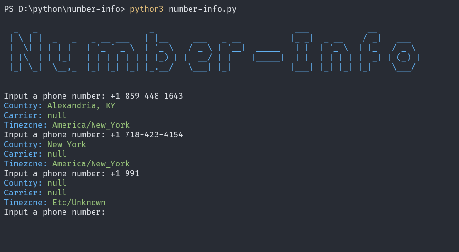

# **Number-Info**

### A simple python number info tool.

## **Use**
- Git clone repository: `git clone https://github.com/hectorwithc/number-info.git`
- Cd into the directory: `cd ./number-info`
- Install required python modules: `pip3 install -r requirements.txt`
- Start the tool: `python3 number-info.py`

## **Requirements**
- **Python3** or later...
- **Pip3** or later...
